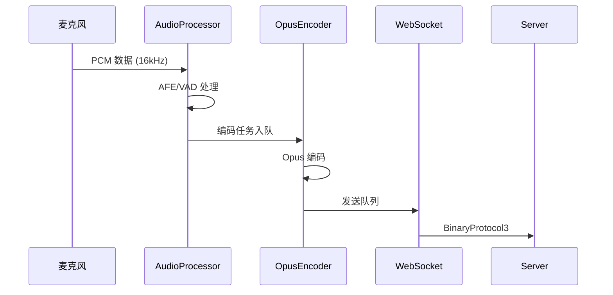
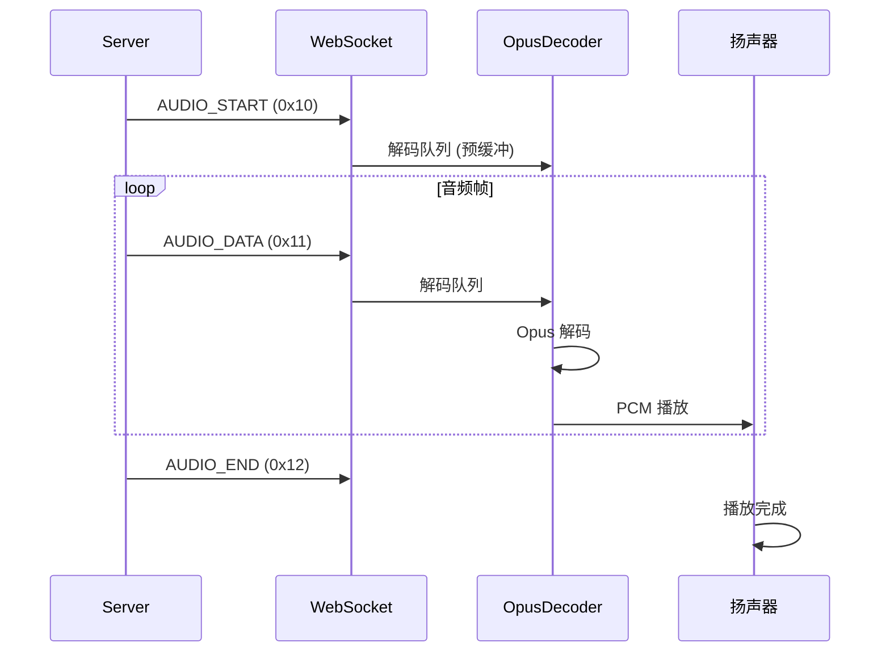

# zhengchen-eye 固件架构分析

## 目录

1. [项目概述](#1-项目概述)
2. [整体架构](#2-整体架构)
3. [核心模块](#3-核心模块)
4. [数据流](#4-数据流)
5. [状态机](#5-状态机)
6. [任务模型](#6-任务模型)
7. [资源管理](#7-资源管理)
8. [分析计划](#8-分析计划)

---

## 1. 项目概述

### 1.1 产品定位
ESP32-S3 语音助手设备固件，支持 4G (ML307) 和 WiFi 双网络模式。

### 1.2 技术栈
| 类别 | 技术 |
|------|------|
| 芯片 | ESP32-S3 |
| 框架 | ESP-IDF v5.4.1 |
| 语言 | C++ (Modern C++11/14) |
| UI | LVGL |
| 音频编码 | Opus |
| 通信协议 | WebSocket (BinaryProtocol3) |
| RTOS | FreeRTOS |

### 1.3 核心能力
- 语音唤醒 (Wake Word Detection)
- 实时语音采集与编码
- WebSocket 双向音频流
- TTS 音频播放
- 表情动画显示
- OTA 升级

---

## 2. 整体架构

### 2.1 分层架构

```
┌─────────────────────────────────────────────────────────────────┐
│                      Application Layer                          │
│  ┌─────────────┐ ┌─────────────┐ ┌─────────────┐ ┌────────────┐│
│  │ Application │ │  MCP Server │ │     OTA     │ │  Settings  ││
│  └─────────────┘ └─────────────┘ └─────────────┘ └────────────┘│
├─────────────────────────────────────────────────────────────────┤
│                        Core Layer                                │
│  ┌─────────────┐ ┌─────────────┐ ┌─────────────┐               │
│  │  EventBus   │ │ EventBridge │ │ DeviceState │               │
│  └─────────────┘ └─────────────┘ └─────────────┘               │
├─────────────────────────────────────────────────────────────────┤
│                      Service Layer                               │
│  ┌─────────────┐ ┌─────────────┐ ┌─────────────┐ ┌────────────┐│
│  │AudioService │ │DisplayEngine│ │Protocol(WS) │ │ConnManager ││
│  └─────────────┘ └─────────────┘ └─────────────┘ └────────────┘│
├─────────────────────────────────────────────────────────────────┤
│                       HAL Layer                                  │
│  ┌─────────────┐ ┌─────────────┐ ┌─────────────┐ ┌────────────┐│
│  │ AudioCodec  │ │   Display   │ │   Network   │ │   Board    ││
│  └─────────────┘ └─────────────┘ └─────────────┘ └────────────┘│
├─────────────────────────────────────────────────────────────────┤
│                    Platform Layer                                │
│  ┌─────────────────────────────────────────────────────────────┐│
│  │              ESP-IDF / FreeRTOS / Drivers                   ││
│  └─────────────────────────────────────────────────────────────┘│
└─────────────────────────────────────────────────────────────────┘
```

### 2.2 目录结构

```
main/
├── main.cc                 # 入口点
├── application.cc/h        # 应用主逻辑
├── device_state.h          # 设备状态枚举
├── settings.cc/h           # 配置管理
├── system_info.cc/h        # 系统信息
├── ota.cc/h                # OTA 升级
├── mcp_server.cc/h         # MCP 服务器
│
├── core/                   # 核心模块
│   ├── event_bus.cc/h      # 事件总线
│   ├── event_bridge.cc/h   # 事件桥接
│   └── event_types.h       # 事件类型定义
│
├── audio/                  # 音频子系统
│   ├── audio_service.cc/h  # 音频服务
│   ├── audio_codec.cc/h    # 编解码器抽象
│   ├── audio_processor.h   # 音频处理器抽象
│   ├── audio_player.cc/h   # 音频播放器
│   ├── playback_controller.cc/h  # 播放控制器
│   ├── wake_word.h         # 唤醒词抽象
│   ├── codecs/             # 编解码器实现
│   ├── processors/         # 处理器实现
│   └── wake_words/         # 唤醒词实现
│
├── display/                # 显示子系统
│   ├── display.cc/h        # 显示抽象
│   ├── display_engine.cc/h # 显示引擎
│   ├── emotion_state.cc/h  # 表情状态
│   ├── lcd_display.cc/h    # LCD 实现
│   └── oled_display.cc/h   # OLED 实现
│
├── network/                # 网络管理
│   ├── connection_manager.cc/h  # 连接管理
│   └── at_scheduler.cc/h   # AT 命令调度
│
├── protocols/              # 通信协议
│   ├── protocol.cc/h       # 协议抽象
│   ├── websocket_protocol.cc/h  # WebSocket 实现
│   └── mqtt_protocol.cc/h  # MQTT 实现
│
├── boards/                 # 板级支持
│   ├── zhengchen_eye/      # 目标板
│   └── ...                 # 其他板型
│
├── led/                    # LED 控制
└── assets/                 # 资源文件
    ├── lang_config.h       # 语言配置
    └── gif*/               # 表情动画
```

---

## 3. 核心模块

### 3.1 Application (应用核心)

**职责**: 系统启动、状态机管理、任务调度

**关键成员**:
```cpp
class Application {
    // 单例模式
    static Application& GetInstance();

    // 核心组件
    std::unique_ptr<Protocol> protocol_;      // 通信协议
    AudioService audio_service_;               // 音频服务
    DisplayEngine display_engine_;             // 显示引擎

    // 状态管理
    DeviceState device_state_;                 // 当前状态
    ListeningMode listening_mode_;             // 监听模式

    // 任务调度
    EventGroupHandle_t event_group_;           // FreeRTOS 事件组
    std::deque<std::function<void()>> main_tasks_;  // 主循环任务队列

    // 核心方法
    void MainEventLoop();                      // 主事件循环
    void Schedule(std::function<void()>);      // 调度任务到主循环
    void SetDeviceState(DeviceState);          // 状态切换
};
```

### 3.2 EventBus (事件总线)

**职责**: 发布/订阅模式的事件分发

**特性**:
- 同步发送 `Emit()` - 立即执行
- 异步发送 `EmitAsync()` - 队列处理
- 优先级支持 (HIGH/NORMAL/LOW)
- 线程安全

**事件类型**:
| 类别 | 事件 | 说明 |
|------|------|------|
| USER | USER_BUTTON_PRESSED | 按钮按下 |
| USER | USER_WAKE_WORD | 唤醒词检测 |
| CONN | CONN_SUCCESS | 连接成功 |
| CONN | CONN_DISCONNECTED | 连接断开 |
| AUDIO | AUDIO_OUTPUT_START | TTS 开始 |
| AUDIO | AUDIO_PLAYBACK_COMPLETE | 播放完成 |
| DISPLAY | DISPLAY_SET_EMOTION | 设置表情 |

### 3.3 AudioService (音频服务)

**职责**: 音频采集、编码、解码、播放

**数据流**:
```
发送链路:
MIC → [AudioProcessor] → {EncodeQueue} → [OpusEncoder] → {SendQueue} → Server

接收链路:
Server → {DecodeQueue} → [OpusDecoder] → {PlaybackQueue} → Speaker
```

**FreeRTOS 任务**:
| 任务 | 优先级 | 职责 |
|------|--------|------|
| AudioInputTask | 高 | 音频采集、处理 |
| AudioOutputTask | 高 | 音频播放 |
| OpusCodecTask | 中 | Opus 编解码 |

### 3.4 Protocol (通信协议)

**职责**: 与服务器通信

**BinaryProtocol3 格式**:
```
┌────────┬──────────┬──────────────┬─────────┐
│ type   │ reserved │ payload_size │ payload │
│ 1 byte │ 1 byte   │ 2 bytes      │ N bytes │
└────────┴──────────┴──────────────┴─────────┘
```

**消息类型**:
| 类型 | 值 | 方向 | 说明 |
|------|-----|------|------|
| AUDIO_DATA | 0x00 | 双向 | 音频数据 |
| AUDIO_START | 0x10 | 接收 | TTS 开始 |
| AUDIO_DATA | 0x11 | 接收 | TTS 数据 |
| AUDIO_END | 0x12 | 接收 | TTS 结束 |
| TEXT_ASR | 0x20 | 接收 | ASR 文本 |
| TEXT_LLM | 0x21 | 接收 | LLM 响应 |

### 3.5 ConnectionManager (连接管理)

**职责**: 连接状态、心跳、重连

**状态机**:
```
DISCONNECTED → CONNECTING → CONNECTED
                   ↓           ↓
              RECONNECTING ←───┘
                   ↓
              DISCONNECTED (重试耗尽)
```

**配置**:
- 心跳间隔: 30 秒
- 心跳超时: 10 秒
- 重连延迟: 1s → 30s (指数退避)
- 最大重试: 5 次

---

## 4. 数据流

### 4.1 语音输入流程



### 4.2 语音输出流程



---

## 5. 状态机

### 5.1 设备状态

```
┌──────────────────────────────────────────────────────────────┐
│                                                              │
│  ┌─────────┐                                                │
│  │ Unknown │──────────────────────┐                         │
│  └─────────┘                      ▼                         │
│                             ┌──────────┐                    │
│                             │ Starting │                    │
│                             └──────────┘                    │
│                                   │                         │
│               ┌───────────────────┼───────────────────┐     │
│               ▼                   ▼                   ▼     │
│       ┌────────────┐        ┌─────────┐        ┌──────────┐│
│       │WiFiConfig  │        │Activating│       │FatalError││
│       └────────────┘        └─────────┘        └──────────┘│
│               │                   │                         │
│               └─────────┬─────────┘                         │
│                         ▼                                   │
│                    ┌─────────┐                              │
│   ┌───────────────▶│  Idle   │◀───────────────┐            │
│   │                └─────────┘                │            │
│   │                     │                     │            │
│   │              Button/Wake                  │            │
│   │                     ▼                     │            │
│   │              ┌────────────┐               │            │
│   │              │ Connecting │               │            │
│   │              └────────────┘               │            │
│   │                     │                     │            │
│   │                  Success                  │            │
│   │                     ▼                     │            │
│   │              ┌────────────┐          Disconnect        │
│   │      ┌──────▶│ Listening  │◀──────┐      │            │
│   │      │       └────────────┘       │      │            │
│   │      │              │             │      │            │
│   │  AUDIO_START   VAD Stop      User Abort  │            │
│   │      │              │             │      │            │
│   │      │              ▼             │      │            │
│   │      │       ┌────────────┐       │      │            │
│   │      └───────│  Speaking  │───────┘      │            │
│   │              └────────────┘               │            │
│   │                     │                     │            │
│   │             AUDIO_END/Timeout             │            │
│   │                     │                     │            │
│   └─────────────────────┴─────────────────────┘            │
│                                                              │
└──────────────────────────────────────────────────────────────┘
```

### 5.2 状态说明

| 状态 | 说明 | 入口 | 出口 |
|------|------|------|------|
| Unknown | 初始状态 | 系统启动 | Starting |
| Starting | 系统初始化 | Unknown | Idle/WifiConfig |
| WifiConfiguring | WiFi 配置 | 未配网 | Idle |
| Idle | 待机 | 初始化完成 | Connecting |
| Connecting | 建立连接 | 按钮/唤醒词 | Listening |
| Listening | 语音录制 | 连接成功 | Speaking |
| Speaking | 语音播放 | AUDIO_START | Listening/Idle |
| Upgrading | OTA 升级 | 检测到新版本 | Reboot |
| FatalError | 致命错误 | 系统异常 | Reboot |

---

## 6. 任务模型

### 6.1 FreeRTOS 任务

| 任务名 | 核心 | 优先级 | 栈大小 | 职责 |
|--------|------|--------|--------|------|
| main (app_main) | 0 | 1 | 8KB | 主循环、状态机 |
| audio_input | 0 | 5 | 4KB | 音频采集 |
| audio_output | 0 | 5 | 4KB | 音频播放 |
| opus_codec | 0 | 4 | 8KB | Opus 编解码 |
| pong_task | 1 | 5 | 2KB | WebSocket PONG |
| event_loop | 1 | 3 | 4KB | 事件分发 |

### 6.2 任务调度模式

**主循环调度**:
```cpp
void Application::MainEventLoop() {
    while (true) {
        // 等待事件
        EventBits_t bits = xEventGroupWaitBits(event_group_, ALL_EVENTS, pdTRUE, pdFALSE, ...);

        // 处理调度任务
        if (bits & MAIN_EVENT_SCHEDULE) {
            std::function<void()> task;
            while (PopTask(task)) {
                task();
            }
        }

        // 处理其他事件...
    }
}
```

**异步任务投递**:
```cpp
void Application::Schedule(std::function<void()> callback) {
    std::lock_guard<std::mutex> lock(mutex_);
    main_tasks_.push_back(callback);
    xEventGroupSetBits(event_group_, MAIN_EVENT_SCHEDULE);
}
```

---

## 7. 资源管理

### 7.1 单例模式

| 类 | 获取方式 | 生命周期 |
|------|----------|----------|
| Application | GetInstance() | 程序全局 |
| EventBus | GetInstance() | 程序全局 |
| ConnectionManager | GetInstance() | 程序全局 |
| Board | GetInstance() | 程序全局 |

### 7.2 智能指针使用

```cpp
// unique_ptr: 独占所有权
std::unique_ptr<Protocol> protocol_;
std::unique_ptr<AudioProcessor> audio_processor_;
std::unique_ptr<WakeWord> wake_word_;

// AudioStreamPacket 传递
std::unique_ptr<AudioStreamPacket> packet;
audio_service_.PushPacketToDecodeQueue(std::move(packet));
```

### 7.3 FreeRTOS 资源

| 资源类型 | 用途 | 创建/销毁 |
|----------|------|-----------|
| EventGroup | 事件同步 | xEventGroupCreate/Delete |
| Queue | 任务间通信 | xQueueCreate/Delete |
| Semaphore | 互斥访问 | xSemaphoreCreateMutex/Delete |
| Timer | 定时任务 | esp_timer_create/delete |
| Task | 并发执行 | xTaskCreate/Delete |

---

## 8. 分析计划

### 8.1 详细分析文档

| 序号 | 文档名 | 内容 | 状态 |
|------|--------|------|------|
| 1 | [MODULE_APPLICATION.md](MODULE_APPLICATION.md) | 应用核心与状态机 | 待创建 |
| 2 | [MODULE_AUDIO.md](MODULE_AUDIO.md) | 音频子系统 | 待创建 |
| 3 | [MODULE_PROTOCOL.md](MODULE_PROTOCOL.md) | 通信协议层 | 待创建 |
| 4 | [MODULE_EVENT.md](MODULE_EVENT.md) | 事件驱动系统 | 待创建 |
| 5 | [MODULE_DISPLAY.md](MODULE_DISPLAY.md) | 显示子系统 | 待创建 |
| 6 | [TIMING_DIAGRAMS.md](TIMING_DIAGRAMS.md) | 时序图集 | 待创建 |
| 7 | [RESOURCE_LIFECYCLE.md](RESOURCE_LIFECYCLE.md) | 资源生命周期 | 待创建 |

### 8.2 分析重点

1. **状态机分析**
   - 状态转换触发条件
   - 边界条件处理
   - 状态竞态问题

2. **音频流分析**
   - 队列容量与溢出
   - 预缓冲策略
   - 延迟优化

3. **通信分析**
   - 消息序列化
   - 错误处理
   - 重连机制

4. **并发分析**
   - 任务优先级
   - 死锁风险
   - 资源竞争

5. **内存分析**
   - 堆使用
   - 栈溢出风险
   - 内存泄漏

---

*文档版本: 1.0*
*最后更新: 2024-12-21*
